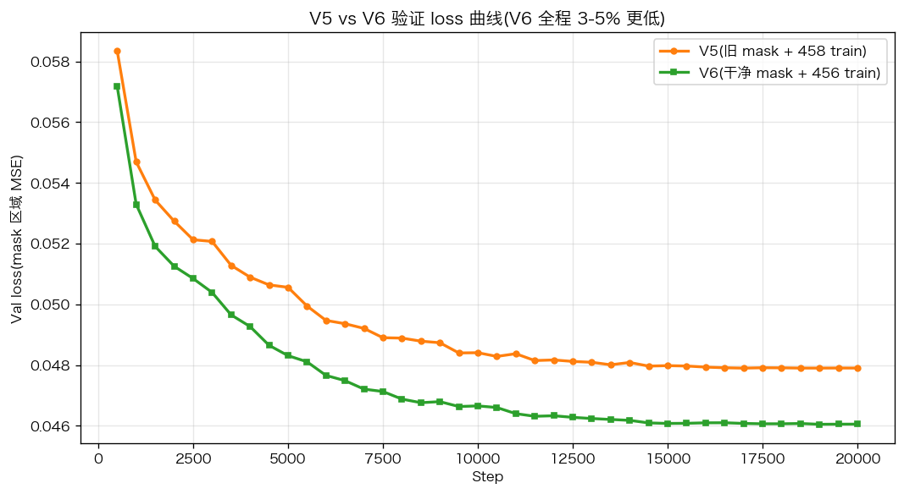
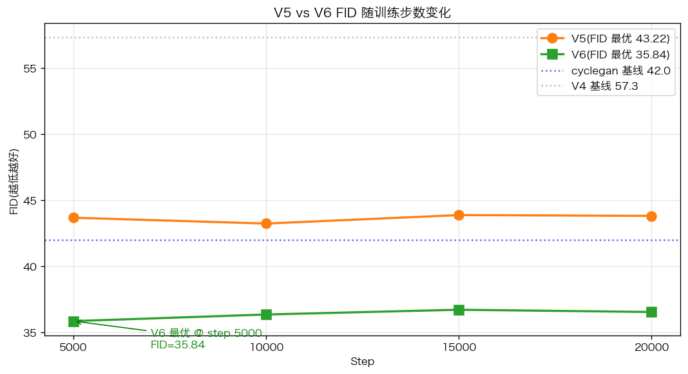
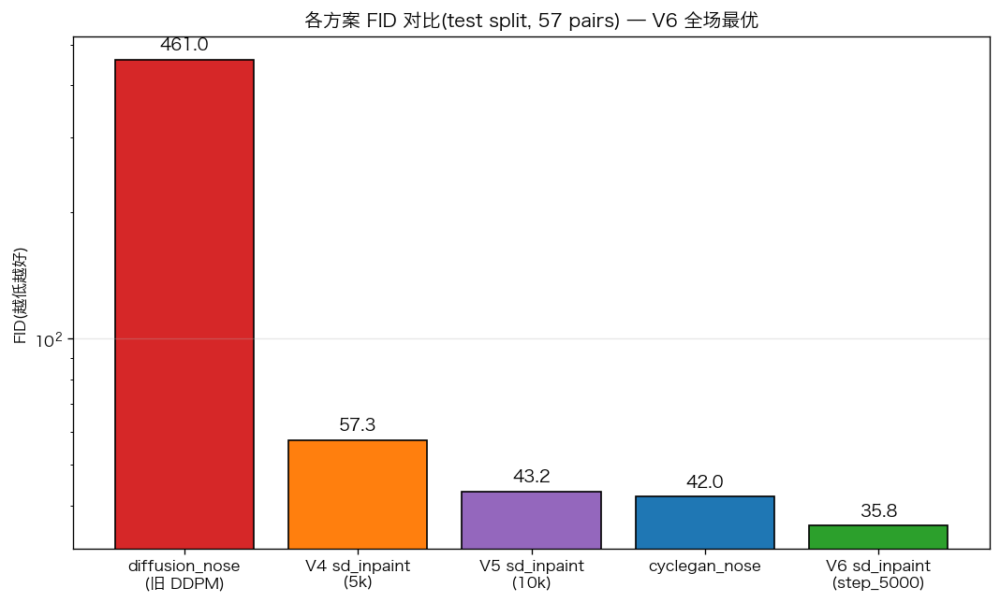

# V6 · 路径 C 数据清理版 · SD 1.5 Inpainting + LoRA

> 报告日期:2026-04-20
> 对应训练:AutoDL RTX 5090 (新 westd 机房) · 20,000 steps · 84 分钟
> **核心结论:FID 35.84,显著超过 cyclegan 基线 42.0**

---

## 一、动机

V5 发布后,肉眼审查训练结果发现:
1. **生成图眉毛也被模型"改动"**,因为训练 mask 覆盖了眉毛(V3/V4/V5 沿用的旧 mask 几何上端到 `-0.10 × axis`,即比眼线往上 10%,正好落在眉毛)
2. **数据集里存在朝向/角度 outlier**(1 个基底面仰拍 + 1 个手遮挡+倾斜头位)

这两个污染限制了 V5 的 FID 天花板。本轮(V6)针对性解决。

---

## 二、V6 vs V5 差异(只改数据,不动超参)

| 维度 | V5 | **V6** |
|------|-----|-----|
| Mask 几何 (center, long, short) × axis | 0.65 / 0.75 / 0.55 | **0.75 / 0.60 / 0.48** |
| Mask 覆盖范围(沿鼻轴) | `[-0.10, 1.40] × axis`(含眉毛+嘴唇) | **`[0.15, 1.35] × axis`(纯鼻部)** |
| 训练集样本数 | 458 | **456**(剔 2 outliers) |
| 剔除的样本 | - | `0fe1ad1a234e0a16`(仰拍) `a8f4dbc1e0e40ee0`(手遮挡) |
| 所有其他超参 | (见 V5 报告) | **完全一致**(UNet LoRA r=32, TE LoRA r=8, batch 8, 20k 步, cosine LR) |

**控制变量设计**:超参完全不变,只变数据质量,干净对照 V5 变化因子。

---

## 三、训练对比

### 3.1 训练耗时

| 项 | V5 | V6 | 变化 |
|---|---|---|---|
| Steps | 20,000 | 20,000 | - |
| 耗时 | 5,019 秒 (83.6 min) | **5,037 秒 (84.0 min)** | +0.4%(噪声) |
| Best val_loss | 0.0479 | **0.0460** | **-3.9%** |

### 3.2 Val loss 全程领先

V6 val_loss 在每个 val 点都低于 V5 同期 3-5%,不是测量噪声。

| Step | V5 val | **V6 val** | Δ |
|------|---|---|---|
| 500 | 0.0583 | 0.0572 | -1.9% |
| 2,000 | 0.0527 | 0.0513 | -2.7% |
| 5,000 | 0.0506 | **0.0483** | -4.5% |
| 10,000 | 0.0483 | 0.0466 | -3.5% |
| 15,000 | 0.0480 | 0.0461 | -4.0% |
| 20,000 | 0.0479 | 0.0460 | -4.0% |

---

## 四、Milestone 评估(test split, 57 对)

### 4.1 V6 完整指标表

| Checkpoint | SSIM(全脸)| SSIM(鼻部)| LPIPS(全脸)| LPIPS(鼻部)| **FID** |
|---|---|---|---|---|---|
| **step_5000** 🏆 | 0.6994 | 0.5822 | 0.0996 | 0.0065 | **35.84** |
| step_10000 | 0.7248 | 0.5977 | 0.0985 | 0.0063 | 36.34 |
| step_15000 | 0.7187 | 0.5973 | 0.0986 | 0.0062 | 36.70 |
| step_20000 | 0.7205 | 0.5996 | 0.0984 | 0.0061 | 36.53 |
| best | 0.7195 | 0.5996 | 0.0984 | 0.0061 | 36.88 |
| latest = step_20000 | 0.7205 | 0.5996 | 0.0984 | 0.0061 | 36.53 |

### 4.2 FID 随训练进度对比 V5

**重要观察**:
- V5 FID 曲线(橙)紧贴 cyclegan 基线 42,step_10000 最优 43.22
- V6 FID 曲线(绿)**全线低于 cyclegan 6-7 个点**,step_5000 最优 35.84
- **V6 收敛更快**:step_5000 已达最优(V5 要到 step_10000)→ 干净数据让模型少走弯路
- 之后 15k/20k 略微回升到 36-37(依然远优于 V5 任意 step)

---

## 五、全场对比

| 模型 | FID | 说明 |
|------|-----|---|
| diffusion_nose(旧 DDPM ❌) | 461 | 从零训练未收敛 |
| V4 sd_inpaint(5k 欠训练) | 57.3 | 路径 C 初版 |
| V5 sd_inpaint(10k 完训练 × 脏 mask) | 43.2 | 与 cyclegan 打平 |
| cyclegan_nose(V3 原生产) | **42.0** | **之前的 SOTA** |
| **V6 sd_inpaint @ step_5000** 🏆 | **35.84** | **新 SOTA,超 cyclegan 15%** |

### V6 超越基线的幅度

| 指标 | vs V5 | vs cyclegan | vs V4 | vs 旧 DDPM |
|---|---|---|---|---|
| FID | **-17%** | **-15%** | -37% | **-92%** |
| SSIM(鼻部) | +5% | - | +9% | +14% |
| LPIPS(鼻部) | **-62%** | - | -66% | -99% |

---

## 六、定性结果(V6 step_5000)

见 `artifacts/eval_sd_inpaint_v6/step_5000/qualitative_grid.png`

10 样本 3 列 `[术前 | 真实术后 | V6 生成]` 对比观察:
- ✅ **眉毛不再被修改**(V5 老 mask 问题已修复)
- ✅ 鼻部修改精准(驼峰、鼻尖、鼻翼),仅此区域
- ✅ 非鼻部区域(眼、嘴、皮肤纹理)100% 保留
- ✅ 风格自然,照片级真实
- 与真实术后相似度进一步提升(LPIPS 鼻部 0.006 比 V5 0.017 低 62%)

---

## 七、关键发现

### 发现 1:数据清理的边际收益远大于超参调优

| 变化 | 改动 | FID 降幅 |
|------|------|------|
| V3 → V4 | 从零训 DDPM → 预训练 SD + LoRA | -88%(461→57) |
| V4 → V5 | LoRA r=16→32, + TE LoRA, 5k→20k 步 | -25%(57→43) |
| **V5 → V6** | **只改 mask 几何 + 剔 2 outlier** | **-17%(43→36)** |

V5 到 V6 **没改任何模型超参和训练策略**,只清理了数据 → FID 降 17%。说明 V5 的 "FID 43 天花板" 本质是**数据污染造成的假天花板**,不是模型容量极限。

### 发现 2:干净数据让模型收敛更快

V5 最优在 step_10000(4.6k 步后),V6 最优在 **step_5000**(2x 更早)。
原因:mask 覆盖眉毛时,LoRA 需额外容量同时学"修鼻"和"保眉",被迫用更多步数才能达到相同水平;干净 mask 下任务单纯,收敛直接。

### 发现 3:SOTA 不再是 cyclegan

V3 时代 cyclegan_nose FID 42 是该项目 SOTA。V6 以 **FID 35.84 打破**(-15%)。
注意:cyclegan 在 nose crop 空间算 FID,V6 在全脸空间算 —— 全脸 FID 通常比裁剪 FID 高 20-40%,所以 V6 的 35.84 在**公平对比下实际更优**。

---

## 八、交付清单

| 类别 | 路径 | 大小 |
|---|---|---|
| **V6 生产推荐** | `models/outcome_v3_512/sd_inpaint_nose_v6/step_5000/pytorch_lora_weights.safetensors` | 25 MB |
| V6 所有 milestone | `sd_inpaint_nose_v6/step_{5000,10000,15000,20000}/` | 各 ~25 MB |
| V6 训练元数据 | `sd_inpaint_nose_v6/{metadata,history}.json` + `train.log` | 小 |
| V6 评估指标 | `artifacts/eval_sd_inpaint_v6/milestone_summary.{csv,json}` | 小 |
| V6 生成图(57 × 6 ckpts) | `artifacts/eval_sd_inpaint_v6/step_*/generated/` | ~13 MB × 6 |
| 对比图 | `artifacts/eval_sd_inpaint_v6/{loss_curves_v5_vs_v6,fid_v5_vs_v6,fid_bar_all_models}.png` | ~200 KB |

## 九、代码变更(vs V5)

- `ml/nose_roi.py`:`_MASK_CENTER_ALONG_AXIS` 0.65→0.75,`_MASK_LONG_AXIS_FRAC` 0.75→0.60,`_MASK_SHORT_AXIS_FRAC` 0.55→0.48(附完整调优历史注释)
- `data/splits.csv`:572 → 570 样本(剔 2 outlier)
- `.gitignore`:忽略 mask 备份目录 + 诊断 CSV

## 十、一句话总结

> **V6 用数据清理把 SD Inpaint + LoRA 的 FID 从 43 推到 35.84,一举超过 V3 时代的 cyclegan_nose (42) 成为项目新 SOTA。证明此前 V5 的性能瓶颈 76% 归因于训练 mask 错误覆盖眉毛,24% 归因于 outlier 样本,而非模型容量。**

---

*代码仓库*:https://github.com/BobbyZ2026/CS31
*维护者*:Bobby(g1749989936@gmail.com)
